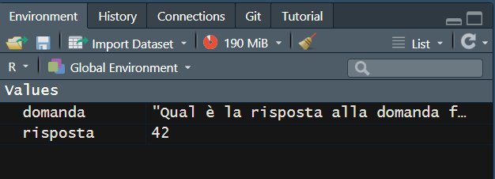

```{r setup, include=FALSE}
knitr::opts_chunk$set(echo = TRUE)
```

# Introduzione a R per l'analisi dati

## Perché imparare R?

La prima domanda che potreste farvi è: perché dovrei voler imparare R?

-   È molto **richiesto** ed **apprezzato** nel mercato del lavoro.

-   Imparare R vi **libera** dalla necessità di imparare qualunque altro software statistico.

-   Al contrario di tutti gli altri, è **gratis.**

-   Vi potrà **facilitare** in tutta una serie di compiti che ancora non sapete nemmeno di dover affrontare nella vostra vita professionale.

Quali sono i **contro** di usare R?

-   All'inizio, è **difficile da imparare**, soprattutto se non avete mai programmato prima. Bisogna essere pazienti e non arrabbiarsi, piano piano ce la si fa.

-   Nella vostra vita professionale potreste far parte di una **minoranza**, e dovete esser pronti ad essere un po' dei lupi solitari

    -   In azienda si usa di più **Tableau, SPSS o Python**

    -   In università si usa di più **Stata**

    -   Nel pubblico si usa di più **Excel/SPSS**

-   Forse verremmo tutti spazzati via da ChatGTP, boh

-   **Consiglio:** seguire [questo libro qui](#0)

    -   Se vi studiate questo libro (che è fatto super bene ed è **gratis e disponibile online**) non vi ferma nessuno. Ed è molto facile da studiare da soli. Iniziamo!

    <!-- -->

    -   Disponibile, in una versione leggermente più datata, [anche in italiano](#0).

### Nota sull'utilizzo di ChatGPT e simili

Sentitevi liberi di utilizzare **ChatGPT** (o qualunque altro modello di intelligenza artificiale) per risolvere ogni problema che dovesse saltare fuori con R.

In particolare, ogni volta che riscontrate un errore:

-   Prima, **leggete l'errore** dal vostro computer e vedete se riuscite a capire cosa succede

-   Poi, chiedete a ChatGPT di **spiegarvi l'errore**, con una formula come [questa](https://chatgpt.com/share/ef997ffe-4d29-4372-a399-94158ba7c856).

    -   Ricordate di dare più **contesto** possibile a ChatGPT nel prompt! In particolare, includete sempre:

        -   Una descrizione del problema che state cercando di risolvere (date sempre più contesto possibile!)

        <!-- -->

        -   Il codice che avete scritto.

        -   L'errore specifico che avete ricevuto (copiaincollato).

        -   Una richiesta esplicita di aiuto e spiegazione.

-   Se anche dopo la risposta di ChatGPT non siete in grado di capire l'errore, scrivetemi una mail (gaetano.scaduto\@unimib.it)

-   **NOTA**: potrete usare ChatGPT in qualunque fase di questo laboratorio. Non è assolutamente un problema, anzi vi incoraggio a farlo.

    -   Ciononostante, voglio che siate **trasparenti** ogni volta che lo utilizzate è bene che lo indichiate esplicitamente (ad esempio, con un #commento) e che siate in grado di **spiegare** il funziomento del codice.

    ## Nota su questi documenti

-   Questi documenti, che sono slide o dispense, come preferite, contengono porzioni di testo e di codice.

-   Sono pensate per essere utilizzate in classe per seguire la lezione o a casa per lo studio individuale, ma è **importante che teniate sempre RStudio aperto** mentre studiate e seguite, e facciate andare i comandi che vedete anche sul vostro computer!

# Comandi di Base

Iniziamo con alcuni comandi di base in R.

### Operazioni Aritmetiche

#### Somma

```{r}
5 + 3

```

#### Sottrazione

```{r}
10 - 4

```

#### Moltiplicazione

```{r}
7 * 3
```

#### Divisione

```{r}
20 / 5
```

### Operatori di Confronto

#### Uguaglianza (==)

```{r}
5 == 5

```

#### Differenza (!=)

```{r}

5 != 3

```

#### Maggiore/Minore di

```{r}
7 > 5


3 < 8


```

#### Maggiore o uguale/Minore o uguale a

```{r}
6 >= 6

# Minore o uguale a
4 <= 9
```

### Operatori Logici

Gli operatori logici ci permettono di combinare più condizioni.

#### AND (&)

```{r}
TRUE & FALSE
```

#### OR (\|)

```{r}
TRUE | FALSE
```

#### NOT (!)

```{r}
!TRUE
```

# Strutture di dati

### Strutture di Dati: Variabili

In R, possiamo memorizzare valori in **variabili**.

```{r}
# Variabile numerica
risposta <- 42

# Stringa
domanda <- "Qual è la risposta alla domanda fondamentale sulla vita, l'universo e tutto quanto?"
```

Quando memorizzate un valore in una variabile, questa comparirà nel vostro **environment** di Rstudio (di solito, in alto a destra)



Una volta che un valore è salvato in una variabile, tutte le volte che avrete bisogno di "evocare" il valore contenuto nella variabile, basterà chiamare il nome della variabile stessa.

Ad esempio, se volessi porre [questa domanda](https://it.wikipedia.org/wiki/Risposta_alla_domanda_fondamentale_sulla_vita,_l'universo_e_tutto_quanto)....

```{r}
domanda
```

Potrei poi darmi una risposta chiamando la variabile ***risposta***

```{r}
risposta
```

In più, posso fare con le variabili tutte le operazioni di cui abbiamo parlato in precedenza.

Per esempio, consideriamo queste due variabili.

```{r}
pigreco=3.1415
costante_gravitazionale=9.81
```

Posso fare tante cose con queste due variabili:

-   sommarle

```{r}
pigreco+costante_gravitazionale
```

-   Moltiplicarle

    ```{r}
    pigreco*costante_gravitazionale
    ```

-   Confrontarle...

```{r}
pigreco>costante_gravitazionale
```

### Strutture di Dati: Vettori

-   Un vettore è una **sequenza di dati** dello stesso tipo (es: numerici, testuali).

-   Per creare un vettore si utilizza il comando ***c(),***

    -   Inserendo gli elementi del vettore separati da una virgola.

```{r}
# Vettore numerico
voti <- c(30, 17, 24, 15, 19)

voti

```

-   Per chiamare uno specifico valore all'interno del vettore, si usano le **parentesi quadre**

    -   Al loro interno si indica, con un numero, la posizione dell'elemento che vogliamo estrarre.

Ad esempio, se volessi sapere cosa contiene il primo elemento del vettore ***voti,*** dovrei scrivere:

```{r}
voti[1]
```

Mentre se volessi il primo ed il terzo elemento, dovremmo mettere un vettore dentro il vettore...

```{r}
voti[c(1,3)]
```

E se volessi sommarli...

```{r}
voti[1]+voti[3]
```

O fare la media...

```{r}
(voti[1]+voti[3])/2
```

-   I vettori possono anche avere valori non numerici.

Ad esempio, possiamo creare un vettore di stringhe

```{r}
# Vettore di stringhe
esiti <- c("promosso", "bocciato", "promosso", "bocciato", "promosso")
```

Anche qui, possiamo chiamare i singoli elementi come prima.

```{r}
esiti[1]
esiti[3]
esiti[c(1,3)]
```

Ma occhio! Non essendo dati testuali, non possiamo sommare gli elementi di questo vettore o ci verrà comunicato un errore!

# Il Dataframe

Un **datatrame** è una struttura di dati fondamentale in R. È molto simile a una tabella di dati. Esso è composto da righe e colonne (o variabili). Si tratta della struttura dati più importante per chiunque faccia statistica

-   Ogni colonna di un dataframe può contenere un **diverso tipo di dati** (numerico, stringhe, ecc.)
-   Tutte le colonne **devono avere la stessa lunghezz**a
-   Le colonne **hanno un nome**, dato dal nome della variabile che le compone.
    -   Le righe, generalmente, non hanno un nome, ma sono indicate solo con numeri interi (1,2,3...)
-   **Non c'è un limite** al numero di righe e colone del dataframe

Potete creare un DataFrame utilizzando la funzione ***data.frame()*** specificando poi i nomi e i valori in ogni colonna. Ecco un esempio:

```{r}
# Creazione di un DataFrame con dati fittizi
dati <- data.frame(
  nomi = c("Anna", "Luca", "Marco"),
  eta = c(28, 34, 29),
  città = c("Roma", "Milano", "Napoli")
)
```

In questo caso abbiamo creato un dataset con tre righe e tre colonne.

Per visualizzare il dataframe abbiamo varie opzioni, la più completa è la funzione ***View()**,* che vi apre direttamente una finestra su Rstudio dove potete esplorare l'intero dataframe

```{r}
View(dati)

```

In alternativa, un modo pratico per capire la struttura del dataset è visualizzarne solo le prime righe con il comando *head()*

```{r}
head(dati)
```

Infine, possiamo anche avere informazioni generali sulle variabili nel dataframe utilizzando il comando ***summary()***

```{r}
summary(data)
```

**Nota:** per il resto della lezione, utilizzerò i termini *dataframe* e *dataset* come sinonimi, anche se tecnicamente sono cose leggermente diverse. A noi non importa.

### Accesso ai dati in un dataframe

Potete accedere ai dati in un dataframe in vari modi:

#### Accesso tramite nome della colonna

```{r}
# Visualizzare la colonna "nomi" 
dati$nomi  
# Visualizzare la colonna "eta" 
dati$eta 

```

#### Accesso tramite indici

```{r}
# Visualizzare la prima colonna 
dati[,1]  
# Visualizzare la prima riga 
dati[1,]  
# Visualizzare l'elemento nella prima riga e nella seconda colonna 
dati[1, 2] 

```

**NOTA BENE:** il primo elemento è sempre l'indice di **riga**, il secondo elemento è sempre l'indice di **colonna**

### Modifica di un DataFrame

Potete aggiungere o modificare colonne e righe in un DataFrame.

#### Aggiungere una colonna

```{r}
# Aggiungere una nuova colonna "sesso" 
dati$sesso <- c("F", "M", "M")  
# Visualizzare il DataFrame aggiornato 
View(dati) 
```

#### Modificare una colonna esistente

```{r}
# Modificare la colonna "eta" 
dati$eta <- c(29, 35, 30)  # Visualizzare il DataFrame aggiornato 
View(dati) 
```

#### Aggiungere una riga

Per aggiungere una riga, bisogna creare un nuovo dataset e successivamente utilizzare la funzione ***rbind()**.*

```{r}
# Creare una nuova riga 
nuova_riga <- data.frame(   nomi = "Giulia",   eta = 26,   città = "Torino",   sesso = "F" )  
# Aggiungere la nuova riga al DataFrame esistente 
dati <- rbind(dati, nuova_riga)  # Visualizzare il DataFrame aggiornato 
View(dati) 
```

### Operazioni sui DataFrame

I dataframe in R supportano una vasta gamma di operazioni. Ecco alcune delle più comuni:

#### Filtrare i dati

```{r}
# Filtrare le righe dove "eta" è maggiore di 30 
dati_filtrati <- dati[dati$eta > 30, ] 
print(dati_filtrati) 

```

#### Ordinare i dati

```{r}
# Ordinare i dati in base alla colonna "eta" 
dati_ordinati <- dati[order(dati$eta), ] 
print(dati_ordinati) 
```

#### Selezionare colonne specifiche

```{r}
# Selezionare solo le colonne "nomi" e "eta" 
dati_selezionati <- dati[, c("nomi", "eta")] 
print(dati_selezionati) 

```

# Esempio Pratico

Mettiamo insieme tutto ciò che abbiamo imparato in un esempio pratico.

```{r}
# Creazione di un DataFrame con informazioni sui partecipanti a un sondaggio

partecipanti <- data.frame(
  ID = 1:5,
  Nome = c("Alice", "Bob", "Charlie", "David", "Eve"),   
  Età = c(24, 30, 22, 28, 35),   
  Città = c("Roma", "Milano", "Napoli", "Torino", "Firenze"),   
  Genere = c("F", "M", "M", "M", "F") 
  ) 

# Visualizzare il DataFrame 
print(partecipanti)  

# Filtrare i partecipanti con età maggiore di 25 
partecipanti_over_25 <- partecipanti[partecipanti$Età > 25, ] 

print(partecipanti_over_25)  

# Ordinare i partecipanti in base all'età 

partecipanti_ordinati <- partecipanti[order(partecipanti$Età), ] 

print(partecipanti_ordinati)  

# Selezionare solo i nomi e le città dei partecipanti 
nomi_città <- partecipanti[, c("Nome", "Città")] 

print(nomi_città) 


```

Per oggi è tutto! Ma non dimenticate di vedere il file degli esercizi!
