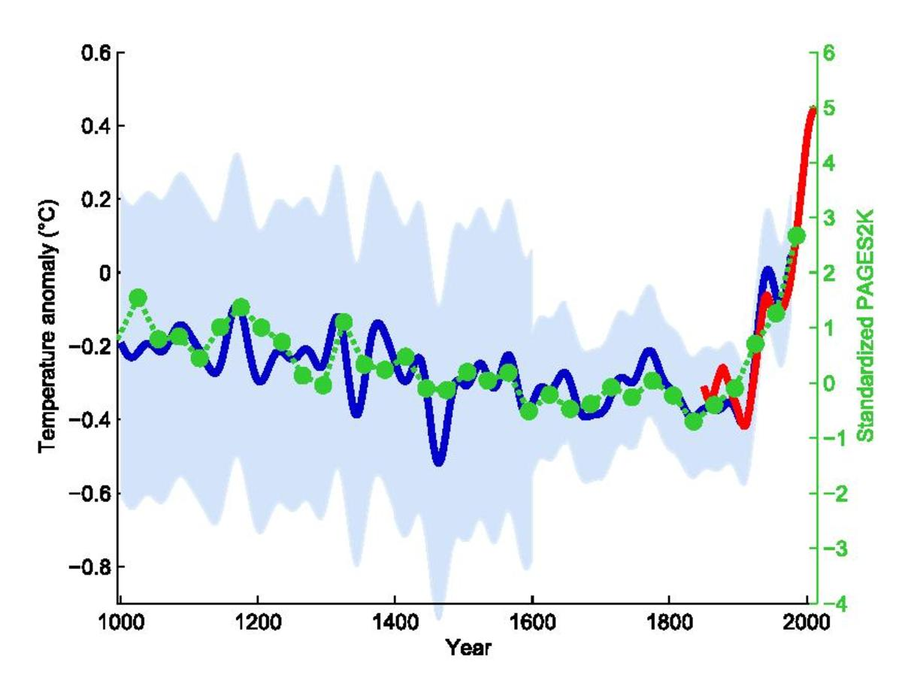

```{r setup, include=FALSE}
knitr::opts_chunk$set(echo = TRUE)
knitr::opts_chunk$set(warning = FALSE)

```

# Data visualisation in the social sciences

```{r, echo=FALSE}

your_rep = "C:/Users/100722gsc/OneDrive - Erasmus University Rotterdam/Postdoc/Teaching/Laboratorio-R/Lezione 2"
```

```{r, eval=FALSE}
your_rep = "C:/Users/gaetanoscaduto/Desktop/Cartella esempio"
```

```{r}
library(ggplot2)
library(rio)
data = import(paste0(your_rep,"/ris2022_lezione.RDS"))
data = data[complete.cases(data), ]
```

## The Importance of Data Visualisation

Data visualisation is a crucial aspect of data analysis in the social sciences, allowing us to transform complex data into intuitive and accessible visual representations, facilitating the understanding, interpretation and communication of social phenomena.

-   A useful and accessible resource is [this book](https://clauswilke.com/dataviz/index.html).
-   Altrimenti, c'è una miriade di video su Youtube

---

#### Why data visualisation is important

1.  **Effective Communication**: The ability to communicate clearly and effectively is essential in the social sciences. Well-designed data visualisations can convey complex information in a simple and immediate way. Charts, maps, and infographics can tell powerful stories, revealing trends and patterns that may not be apparent from the raw data.

    -   A famous example of this is the [*hockey stick graph*](https://time.com/6328017/climate-change-hockey-stick/), which for the first time showed the general public a powerful visualisation of global warming (it has only gotten worse since then).

    ```{r, echo=FALSE}
    
    ```

2.  **Identifying Patterns and Trends**: Data visualisation helps identify patterns, trends, and relationships between variables. For example, a scatterplot can reveal a correlation between income and education level, while a bar plot can show the distribution of the population by age group in different regions.

---

3.  **Exploratory Data Analysis**: Before conducting detailed statistical analyses, it is useful to visually explore the data to understand its main characteristics. Data visualisation allows you to quickly identify outliers, distributions, and anomalies that could influence the results of the analysis. For example, if you did the difficult exercise assigned in the last lesson...

    ```{r}
    ggplot(data, aes(x=M5S, y=superficie))+
      geom_point()+
      labs(title = "Scatterplot",
           x = "M5S Votes share", y = "Surface of the Municipality") +
      theme_minimal()


    ```

In this scatterplot of votes for the Five Star Movement by municipal area, we can see that, even though there is no clear law relating the two variables, there are **two dots** that stand out for their 'anomalous' values. One is for a huge area (and we can even work out which one it is) and the other is for an anomalous percentage of votes for the Five Star Movement...

```{{r}}
outliers <- c("ROMA", "VOLTURARA APPULA")

p <- ggplot(data, aes(x = M5S, y = superficie)) +
  geom_point(aes(color = comune %in% outliers)) +  # Colora gli outlier in modo diverso
  scale_color_manual(values = c("black", "red")) +  # Specifica i colori per i punti
  geom_text(data = data[data$comune %in% outliers,],    # Aggiungi le etichette per gli outlier
            aes(label = comune),
            vjust = 1, hjust = 0.5, color = "red", size=3) +
  labs(title = "Scatterplot with Highlighted and Annotated Outliers",
       x = "M5S Votes share", y = "Municipality Area") +
  xlim(0,100)+
  theme_minimal()+
    theme(legend.position = "none")

p
```

---

4.  **Decision Support**: In policy-making, academic research or business management contexts, decisions based on clearly visualised data are often more informed and justifiable. The ability to present complex data in a way that is understandable to decision-makers can facilitate the adoption of effective measures.

    -   Unfortunately, there are also many other dynamics at play...

5.  **Transparency and Accessibility**: Data visualisation promotes transparency, making data accessible even to a non-specialist audience. This is particularly important in the social sciences, where research often informs public policy and decisions that affect society as a whole.

## Displaying data on R: ggplot2

`ggplot2` is a package (or library) for R that allows you to build complex graphs in an intuitive and modular way (using so-called "layers").

Prima di poter utilizzare `ggplot2`, è necessario caricare il pacchetto. Se non lo hai già installato, puoi installarlo usando `install.packages("ggplot2")`.

```{r, eval=F}
install.packages("ggplot2")
```

```{r, warning = FALSE}
# Caricare ggplot2
library(ggplot2)
```

-   The `ggplot()` function creates a **ggplot object**.
-   This object is the starting point for constructing the graph. It is an empty box to which we will add layers.
-   The main arguments of `ggplot()` are the **dataset** and **aesthetics** (aes), which defines the variables to be represented on the graph axes.

# Tipi di visualizzazioni

## Two continuous variables: the scatterplot

-   A scatterplot is a type of graph used to show the relationship between two continuous (numerical) variables

-   It allows us to easily begin exploring the mechanisms through which ggplot2 works.

```{r}
p <- ggplot(data, #the dataset from which we take the variables 
            aes(x = M5S, #the variable we want to display on the x-axis
                y = superficie #the variable we want to display on the y-axis (not always necessary!)
                )
            )
```

In questo momento, p è un grafico vuoto

```{r}
p 
```

---

-   We can continue to build the graph by adding layers to the ggplot object with the + operator.

-   The most common command adding a layer for scatterplots is geom_point()

```{r}
p1 <- p + geom_point()
```

Vediamo adesso cosa "c'è dentro p1"

```{r}
p1
```

This scatterplot in particular has a problem: there are too many overlapping dots.

-   There are various ways to solve this problem (with a good prompt, you could ask Claude to list them all for you!).

-   One is to manually set the "transparency" of the dots using the **alpha option**.

    -   The (fractional) value given to alpha indicates the number of dots that must overlap to have the equivalent of one black dot.

```{r}
p1 <- p + geom_point(alpha=1/10)

p1
```

---

Now the graph is already easier to read.

We can customise the chart in any way we want. For example, we can manually set the colour, shape, and size of the dots!

```{r}
p1 <- p + geom_point(alpha=1/3, #transparency
                     colour="red",#colours must be enclosed in quotation marks! How can you remember this? Make a mistake and then ask chatgpt!
                     shape=6, #you can search online for the number-shape correspondence!
                     size=3)

p1
                     
```

-   Any aesthetic changes made to a graphic should be done with the aim of maximising its communicative effectiveness (what a complex sentence!).

-   This means, for example, that colours can be used to uncover relationships between data.

-   For example, instead of colouring all the points uniformly, we can vary the colour based on a variable.

-   In our case, let's try colouring based on the macro-geographical area.

    -   Note that when we make the colour dependent on a variable (so it is no longer constant for all data), this must be passed to the aes() function, which we can put directly inside geom_point!

```{r}
p1 <- p + geom_point(aes(col=macroarea))

p1
```

Please also note that R has automatically inserted useful legends to make the graph easier to read.

## Axes: annotation and extension

-   One thing that stands out in the previous graph is that the relationship we have just discussed is somewhat obscured by the fact that the x-axis is very crowded in the 0-20 range.

-   We can try to solve the problem slightly by changing alpha, but this only helps to a certain extent.

```{r}

p2 <- p + geom_point(aes(col=macroarea),
                     alpha=1/5)

p2

```

---

-   The problem is that we have too much 'empty' space in the chart, both at the top and on the right.

    -   This happens because ggplot wants us to see all the data, and thus also has to include the outliers identified previously

-   We could therefore decide to cut it away, reshaping the limits of our axes.

-   There are many ways to do this (ask GPT!), but one of the simplest is to use the xlim() and ylim() functions.

    -   As the argument for these two functions, we will put the values where we want our axes to start and end.

In keeping with the spirit of ggplot, we add these arguments as layers.

```{r}
p3=p2+
  xlim(0,50)+
  ylim(0,500)

p3
  
```

Another thing we can do is change the names of the axes to make them more informative and easier to read for our audience.

In this case, we use the ***xlab()*** and ***ylab()*** functions.

```{r}
p4=p3+
  xlab("Vote share of M5S")+
  ylab("Area (in m2) of the municipality")

p4
```

## An easy way to visualise a regression with a single dependent variable

-   We might have wondered whether there is a relationship between the size of the municipality and the vote for the Five Star Movement..
-   A very simple and intuitive way to verify this is to find the regression line in the surface \~ M5S relationship. With ggplot, this can be done quickly and easily..

```{r}
p5=p4 +
  geom_smooth(method = "lm")

p5
```

---

-   There is a correlation, albeit weak, between the size of the municipality and the vote for the Five Star Movement.

-   We can also assume, for example, that this relationship varies from macro-area to macro-area.

-   We could therefore try to calculate, separately, a regression line for each macro-area.

-   To do this, we can again group the data by colour, but this time in geom_smooth!

```{r}
p5=p4 +
  geom_smooth(aes(col=macroarea),
              method = "lm")

p5
```

---

to highlight these relationships clearly, we need to adjust some of the graph parameters.

```{r}
definitive_graph = ggplot(data, aes(x=M5S, y=superficie))+
  geom_point(aes(colour = macroarea),
             alpha=1/10)+
  geom_smooth(aes(colour = macroarea),
    method = "lm",
    linewidth=2)+
  xlim(0,50)+
  ylim(0,500)+
  xlab("Percentage of votes obtained by the Five Star Movement")+
  ylab("Area (in m2) of the municipality")

definitive_graph
```

What does all this mean? Let's discuss it..

## Univariate distributions: Bar charts and histograms

-   It is not always of interest to show the relationship between two or more variables.

-   Sometimes, it can be more interesting to simply show how a variable is distributed..

-   Depending on whether this variable is numerical or categorical, we have several possible visualisations that we can use: the histogram and the bar chart (barplot).

Although they may appear similar, they serve different purposes and represent different data. Let's look at the main differences..

---

#### Univariate distributions of numerical variables: Histogram

-   A histogram is used to represent the distribution of a single continuous (numerical) variable.

-   It divides the data into intervals (or 'bins') and shows the number of observations that fall into each interval.

<!-- -->

-   **Data**: Continuous variable (e.g., height, weight, time).

-   **X-Axis**: Intervals (bins) of the continuous variable.

-   **Y-Axis**: Frequency (number of observations) for each interval.

-   **Purpose**: Display the distribution of a single continuous variable.

For example, we can create a histogram with ggplot2 that shows us the distribution of votes for Fratelli d'Italia across the municipalities.

```{r}
histogram = ggplot(data, aes(x=Fdi))+
  geom_histogram()
  
  #Nota che essendo un grafico univariato, non abbiamo bisogno di una y!

histogram
```

---

-   We can refine our visualisation with the "bindwidth" option, which allows us to control the width of the bins.

-   For example, we want each bin to be 1 wide (equal to a group of 1%: councils where FDItook 15.1% and 15.9% are grouped in the same bin)..

```{r}
histogram = ggplot(data, aes(x=Fdi))+
  geom_histogram(binwidth = 1)
  

histogram
```

Here too, we can change the colour if we want.

```{r}
histogram = ggplot(data, aes(x=Fdi))+
  geom_histogram(binwidth = 1,
                 col="blue")
  

histogram
```

---

That wasn't what we expected, was it? That's because the option col (or colour, equivalently) in histograms only colours the edges. To colour the interior as well, we use the "fill" option.

```{r}

histogram = ggplot(data, aes(x=Fdi))+
  geom_histogram(binwidth = 1,
                 fill="blue")
  

histogram
```

Or perhaps we may also want to colour the edges and the inside with different colours.

```{r}

histogram = ggplot(data, aes(x=Fdi))+
  geom_histogram(binwidth = 1,
                 col="black",
                 fill="blue")
  

histogram
```

What does this histogram tell us?

---

#### Barplot

-   A barplot is used to represent categorical data or the frequency of discrete categories.

-   It shows the quantity or frequency of each category through the height of the rectangular bars.

-   **Data**: A single categorical variable.

-   **X-axis**: Categories.

-   **Y-axis**: Frequency or value associated with each category.

-   **Purpose**: To compare the frequency or value between different categories.

An example of a categorical variable in our dataset is the variable "most_voted" variable, which indicates, for each municipality, which party received the most votes (it has seven categories corresponding to the seven main parties). We can visualise how this variable is distributed with a bar plot, which in ggplot2 is constructed with the geom_bar() command.

```{r}
barplot = ggplot(data, aes(x=most_voted))+
  geom_bar()

barplot
```

---

Some of the things we might want to do here are:

-   Sort the columns based on the most voted party

-   Colour each bar with the party's typical colour.

These two operations are feasible but a bit tedious, and explaining them would take too long..

Ovviamente, per chi lo volesse fare da sè, è apprezzato (classica cosa per cui ChatGPT è la soluzione migliore!)

#### Summary of Differences

| Feature | Histogram | Barplot |
|---|---|---|
| Data Type | Continuous | Categorical or discrete |
| X-axis | Intervals of the continuous variable | Categories |
| Y-axis | Frequency of observations | Frequency or value associated with categories |
| Purpose | Show the distribution of a continuous variable | Compare the frequency or value between categories |

# A categorical variable and a continuous variable: distributions by groups

-   Suppose we want to show how to highlight the relationship between a categorical variable and a continuous one.

-   In this case, all we need to do is use what we have learnt for continuous variables when they are alone, and repeat it for each category.

    -   We do have other options, yes, but let's not complicate matters..

-   For example, suppose we want to see how the vote for Azione-Italia Viva is distributed based on the variable "areeint".

    -   ***areeint*** reports the ISTAT internal area code, where A indicates very central areas (large cities, regional capitals) and F indicates isolated municipalities further away from the centres.

-   To see this relationship, what we can do is create a histogram of the distribution of Az-IV votes in each of these areas.

-   To do this, use the ***facet_wrap()*** function with the variable name preceded by a tilde (\~) inside it.

```{r}
histogram_per_area = ggplot(data, aes(x=Aziv))+
  geom_histogram()+
  facet_wrap(~areeint, 
             scales = "free")

histogram_per_area
```

-   In municipalities in bands A and B, Azione-Italia Viva has a less left-concentrated distribution.

-   This is due to the fact that this party performed better in larger, central municipalities than in peripheral areas.

\# Two variables, both categorical

-   The last case we have is when both variables we are interested in are **two** and are **both** **categorical**.

-   In this case, an effective visualisation is provided by a *countplot* or *count diagram*.

-   Through this diagram, we can observe how the frequency is distributed between two categorical variables.

-   An example could be to use the variables most_voted and internal_areas to see what relationship there is between these two variables. To do this, use the function ***geom_count()***.

```{r}

countplot = ggplot(data, aes(x=areeint, y=most_voted))+
  geom_count()

countplot
```

There are also more attractive and appealing solutions than this one (such as tileplots). If you feel like it, discover them for yourself, but they may be a bit more complicated.

# Summing up

| Chart Type | When to Use | Pros | Cons |
|---|---|---|---|
| Histogram | To visualise the distribution of a continuous variable | Easy to interpret, shows the distribution | The choice of bins can influence interpretation and readability |
| Barplot | To compare frequency or value between discrete categories | Easy to interpret, ideal for comparisons between categories | Becomes complex to sort and label using ggplot2 |
| Scatterplot | To examine the relationship between two continuous variables | Clearly shows the relationship between two variables, facilitates the identification of correlations and outliers. It is also possible to fit a nice and convincing regression line. | Can become crowded with many points, so you need to play around with shapes, colours and transparency |
| Countplot | To examine the relationship between two categorical variables | Effective for visualising contingency tables, facilitates comparison between combinations of categories | Can be difficult to interpret with many categories and proportions may often not be obvious |
| Histograms by category | To compare the distribution of a continuous variable across categories | Shows the distribution of the variable for each category, effective for comparing groups | Consider whether to keep the axes constant and the consequences this may have |
