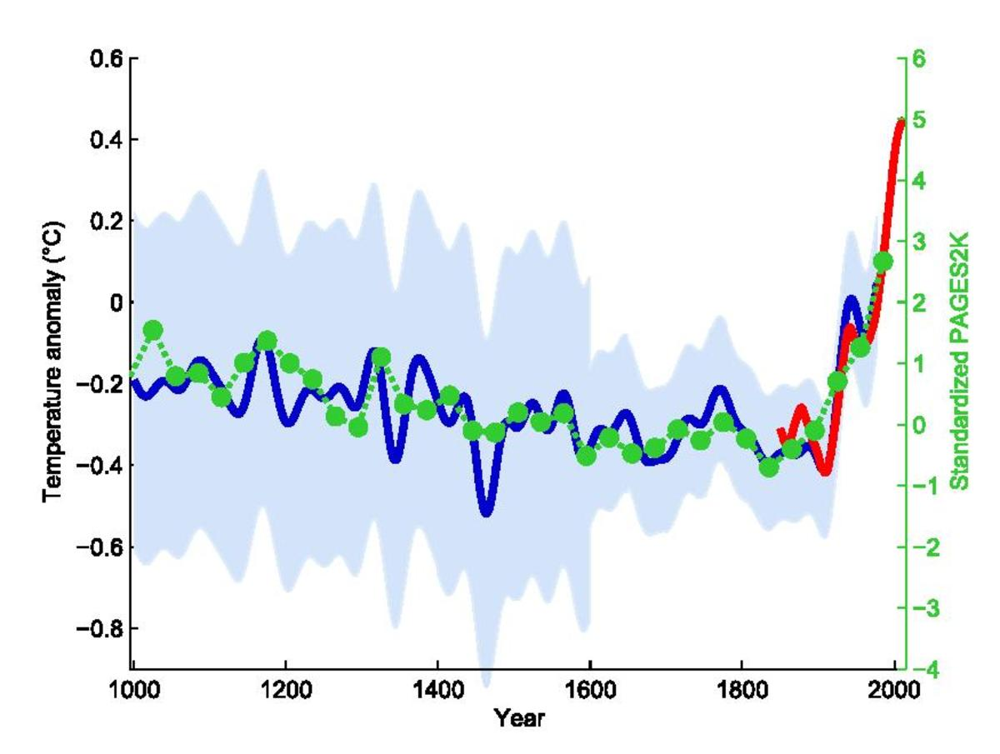

```{r setup, include=FALSE}
knitr::opts_chunk$set(echo = TRUE)
knitr::opts_chunk$set(warning = FALSE)

```

# Data Visualization nelle Scienze Sociali

```{r, echo=FALSE}

vostra_cartella = "C:/Users/gasca/OneDrive - Università degli Studi di Milano-Bicocca/Dottorato/Didattica/Lab 2024/Laboratorio-R/Lezione 2"
```

```{r}
library(ggplot2)
library(rio)
data = import(paste0(vostra_cartella,"/ris2022_lezione.RDS"))
data = data[complete.cases(data), ]
```

## L'Importanza della Data Visualization

La visualizzazione dei dati, è un aspetto cruciale dell'analisi dei dati nelle scienze sociali, che ci permette di trasformare dati complessi in rappresentazioni visive intuitive e accessibili, facilitando la comprensione, l'interpretazione e soprattutto la comunicazione dei fenomeni sociali.

-   Una risorsa utile e accessibile (purtroppo solo in inglese) è rappresentata da [questo libro](https://clauswilke.com/dataviz/index.html).

#### Perché la Data Visualization è fondamentale?

1.  **Comunicazione Efficace**: La capacità di comunicare in modo chiaro ed efficace è essenziale nelle scienze sociali. Le visualizzazioni di dati ben progettate possono trasmettere informazioni complesse in modo semplice e immediato. Grafici, mappe e infografiche possono raccontare storie potenti, rivelando tendenze e pattern che potrebbero non essere evidenti dai dati grezzi.

    -   Un famoso esempio di ciò è il [*grafico a mazza da hockey*](https://time.com/6328017/climate-change-hockey-stick/) che per la prima volta mostrò al publico di massa una potentissima visualizzazione del riscaldamento globale (è solo andato peggiorando).

    ```{r, echo=FALSE}
    
    ```

2.  **Identificazione di Pattern e Tendenze**: La visualizzazione dei dati aiuta a identificare pattern, tendenze e relazioni tra variabili. Ad esempio, un grafico a dispersione (*scatterplot*) può rivelare una correlazione tra il reddito e il livello di istruzione, mentre un grafico a barre (*barplot*) può mostrare la distribuzione della popolazione per fascia d'età in diverse regioni.

3.  **Analisi Esplorativa dei Dati**: Prima di condurre analisi statistiche dettagliate, è utile esplorare visivamente i dati per comprendere le loro caratteristiche principali. La data visualization permette di individuare rapidamente *outliers*, distribuzioni e anomalie che potrebbero influenzare i risultati dell'analisi. Ad esempio, se avete fatto l'esercizio difficile assegnato la scorsa lezione...

    ```{r}
    ggplot(data, aes(x=M5S, y=superficie))+
      geom_point()+
      labs(title = "Scatterplot",
           x = "Voto ai 5 Stelle", y = "Superficie del comune") +
      theme_minimal()


    ```

    Ad esempio, in questo scatterplot di voto ai cinque stelle per superficie del comune possiamo vedere che, anche se non c'è una chiara legge che metta in relazione le due variabili, ci sono due puntini che spiccano per valori "anomali". Uno per una superficie enorme (e possiamo anche arrivare a capire quale sia) e l'altro per una percentuale anomala di voti ai 5 stelle...

    ```{r}
    outliers <- c("ROMA", "VOLTURARA APPULA")

    p <- ggplot(data, aes(x = M5S, y = superficie)) +
      geom_point(aes(color = comune %in% outliers)) +  # Colora gli outlier in modo diverso
      scale_color_manual(values = c("black", "red")) +  # Specifica i colori per i punti
      geom_text(data = data[data$comune %in% outliers,],    # Aggiungi le etichette per gli outlier
                aes(label = comune),
                vjust = 1, hjust = 0.5, color = "red", size=3) +
      labs(title = "Scatterplot con Outlier Evidenziati e Annotati",
           x = "Voto ai 5 Stelle", y = "Superficie del comune") +
      xlim(0,100)+
      theme_minimal()+
        theme(legend.position = "none")

    p
    ```

4.  **Supporto alle Decisioni**: Nei contesti di policy-making, ricerca accademica o gestione aziendale, le decisioni basate su dati visualizzati in modo chiaro sono spesso più informate e giustificabili. La capacità di presentare dati complessi in modo comprensibile ai decisori può facilitare l'adozione di misure efficaci.

    -   Purtroppo, ci sono anche tante altre dinamiche che intervengono...

5.  **Trasparenza e Accessibilità**: La visualizzazione dei dati promuove la trasparenza, rendendo i dati accessibili anche a un pubblico non specializzato. Questo è particolarmente importante nelle scienze sociali, dove le ricerche spesso informano politiche pubbliche e decisioni che riguardano la società nel suo complesso.

## Visualizzare i dati su R: ggplot2

Tra i numerosi strumenti disponibili per la visualizzazione dei dati, `ggplot2` è il più utilizzato in R. `ggplot2` è un pacchetto (o libreria) per R che permette di costruire grafici complessi in modo intuitivo e modulare (per cosiddetti "layers").

Prima di poter utilizzare `ggplot2`, è necessario caricare il pacchetto. Se non lo hai già installato, puoi installarlo usando `install.packages("ggplot2")`.

```{r}
install.packages("ggplot2")

# Caricare ggplot2
library(ggplot2)
```

La funzione `ggplot()` crea un **oggetto ggplot**. Questo oggetto è il punto di partenza per costruire il grafico. Una scatola vuota a cui noi andremo aggiungendo dei layers. Gli argomenti principali di `ggplot()` sono il dataset e l'estetica (aes), che definiscono le variabili da mappare agli assi del grafico.

# Tipi di visualizzazioni

## Due variabili continue: Lo scatterplot

Proviamo a costruire passo passo lo *scatterplot* dei voti al Movimento 5 Stelle per superficie. Lo scatterplot è un tipo di grafico che si utilizza quando si vuole mostrare la relazione fra due variabili continue (numeriche) e ci permette di iniziare ad esplorare agevolmente i meccanismi attraverso cui funziona ggplot2.

```{r}
p <- ggplot(data, #il dataset da cui prendiamo le variabili 
            aes(x = M5S, #la variabile che vogliamo visualizzare sull'asse x
                y = superficie #la variabile che vogliamo visualizzare sull'asse y (non è detto che ci sia sempre bisogno!)
                ))
```

In questo momento, p è un grafico vuoto

```{r}
p 
```

Possiamo continuare a costruire il grafico aggiungendo livelli (layers) all'oggetto ggplot con l'operatore `+`. Il livello più comune è `geom_point()` per i grafici a dispersione (scatter plots).

```{r}
p1 <- p + geom_point()
```

Vediamo adesso cosa "c'è dentro p"

```{r}
p1
```

Questo scatterplot in particolare ha un problema: ci sono troppi puntini che si sovrappongono. Esistono vari modi per risolvere questo problema (con un buon prompt, potreste chiedere a ChatGPT di elencarveli tutti!) ma uno consiste nel settare manualmente la "trasparenza" dei puntini con l'opzione ***alpha.*** Il valore (frazionario) che data ad alfa indica il numero di puntini che devono sovrapporsi per avere l'equivalente di un puntino nero.

```{r}
p1 <- p + geom_point(alpha=1/10)

p1
```

Adesso il grafico è già più informativo. Ma noi possiamo personalizzare il grafico in tutti i modi che vogliamo. Ad esempio, possiamo fissare manualmente colore, forma, e dimensione dei pallini!

```{r}
p1 <- p + geom_point(alpha=1/3, #trasparenza
                     color="red",#i colori vanno tra virgolette! Come ricordarlo? Sbaglia e poi chiedi a chatgpt!
                     shape=6, #puoi cercare online la corrispondenza numeri-forme!
                     size=3)

p1
                     
```

Ogni modifica estetica fatta ad un grafico dovrebbe essere apportata al fine di massimizzare la sua efficacia comunicativa (che frase complessa!). Ciò significa, per esempio, che fra le altre cose i colori possono essere usati per scovare delle relazioni fra i dati. Ad esempio, invece di colorare tutti i punti in maniera omogenea, possiamo far variare il colore sulla base di una variabile. Nel nostro caso, proviamo a colorare sulla base della macroarea geografica. Notate che quando facciamo dipendere il colore da una variabile (quindi non è più costante per tutti i dati) questo va passato alla funzione ***aes()***, che possiamo mettere direttamente dentro geom_point!

```{r}
p1 <- p + geom_point(aes(col=macroarea))

p1
```

Cosa salta all'occhio? Commentiamo questo grafico!

Notate anche che R ha automaticamente inserito delle comode leggende per poterci far leggere meglio il grafico

## Assi: annotazione ed estensione

Una cosa che salta all'occhio nel grafico precedente è che la relazione che abbiamo appena commentato è un po' mortificata dal fatto che l'asse x è molto affollato nell'area 0-20. Possiamo provare a risolvere leggermente il problema cambiando alpha, ma questo aiuta fino ad un certo punto.

```{r}

p2 <- p + geom_point(aes(col=macroarea),
                     alpha=1/5)

p2

```

Il problema è che abbiamo troppo spazio "vuoto" nel grafico, sia in alto che a destra. Potremmo dunque decidere di tagliarlo via, rimodulando i limiti dei nostri assi. Per farlo ci sono molti modi (chiedete a GPT!) ma uno dei più semplici è utilizzare le funzioni xlim() e ylim(). Come argomento di queste due funzioni metteremo i valori dove vogliamo che inizino e finiscano i nostri assi.

Sempre nello spirito di ggplot, aggiungiamo questi argomenti come *layers.*

```{r}
p3=p2+
  xlim(0,50)+
  ylim(0,500)

p3
  
```

Un'altra cosa che possiamo fare è cambiare i nomi degli assi per renderli più informativi e più facili da leggere per il nostro pubblico. In questo caso, utilizziamo le funzioni ***xlab()*** e ***ylab().***

```{r}
p4=p3+
  xlab("Percentuale di voti presa dal Movimento 5 Stelle")+
  ylab("Superficie (in m2) del comune")

p4
```

## Un modo facile per visualizzare una regressione con una sola variabile dipendente

A questo punto, dopo tutto questo giocare con gli scatterplot, ci potrebbe essere venuto il dubio che esista una relazione fra la superficie del comune ed il voto al movimento 5 stelle. Un modo molto semplice ed intuitivo per verificarlo consiste nel trovare la retta di regressione nella relazione superficie \~ m5s. Con ggplot, lo si può fare in un modo semplice e veloce

```{r}

p5=p4 +
  geom_smooth(method = "lm")

p5
```

Come possiamo vedere, esiste una relazione, seppur debole, fra la superficie del comune ed il voto al Movimento 5 stelle. Possiamo anche supporre, ad esempio, che questa relazione però vari da macroarea a macroarea. Potremmo quindi provare a calcolare, separatamente, una retta di regressione per ogni macroarea. Per farlo, possiamo di nuovo raggruppare i dati per colore, ma questa volta in geom_smooth!

```{r}
p5=p4 +
  geom_smooth(aes(col=macroarea),
              method = "lm")

p5
```

Riusciamo a vedere qualcosa, ma per evidenziare bene queste relazioni, dobbiamo aggiustare un po' di parametri grafici. Rifacendo il grafico da capo, avremo:

```{r}
definitivo = ggplot(data, aes(x=M5S, y=superficie))+
  geom_point(aes(colour = macroarea),
             alpha=1/10)+
  geom_smooth(aes(colour = macroarea),
    method = "lm",
    linewidth=2)+
  xlim(0,50)+
  ylim(0,500)+
  xlab("Percentuale di voti presa dal Movimento 5 Stelle")+
  ylab("Superficie (in m2) del comune")

definitivo
```

Cosa significa tutto questo? Commentiamo

## Distribuzioni univariate: Il grafico a barre e l'istogramma

Non sempre mostrare la relazione fra due o più variabili è di interesse. A volte, può essere più interessante anche solo mostrare come si distribuisce una variabile. A seconda che questa variabile sia *numerica* o *categoriale* abbiamo diversi possibili visualizzazioni che possiamo utilizzare: l'istogramma ed il grafico a barre (*barplot*).

Anche se possono sembrare simili, essi servono a scopi differenti e rappresentano dati diversi. Vediamo le principali differenze:

#### Istogramma

Un istogramma è utilizzato per rappresentare la **distribuzione di una singola variabile continua**. Esso divide i dati in intervalli (o "bin") e mostra il numero di osservazioni che cadono in ciascun intervallo.

-   **Dati**: Variabile continua (ad esempio, altezza, peso, tempo).

-   **Asse X**: Intervalli (bin) della variabile continua.

-   **Asse Y**: Frequenza (numero di osservazioni) per ciascun intervallo.

-   **Scopo**: Mostrare la distribuzione di una variabile continua.

Per esempio, possiamo creare un istogramma, con ggplot2, che ci mostri la distribuzione dei voti per Fratelli d'Italia.

```{r}
istogramma = ggplot(data, aes(x=Fdi))+
  geom_histogram()
  
  #Nota che essendo un grafico univariato, non abbiamo bisogno di una y!

istogramma
```

Anche qui, possiamo raffinare la nostra visualizzazione in molti modi, ad esempio con l'opzione "bindwidth" che ci permette di controllare l'ampiezza dei bin. Per esempio, vogliamo che ogni bin sia ampio 1 (pari ad un gruppo di un 1%: comuni dove fdi ha preso il 15,1% e il 15,9% vengono raggruppati nello stesso bin).

```{r}
istogramma = ggplot(data, aes(x=Fdi))+
  geom_histogram(binwidth = 1)
  

istogramma
```

Anche qua, possiamo cambiare il colore se vogliamo.

```{r}
istogramma = ggplot(data, aes(x=Fdi))+
  geom_histogram(binwidth = 1,
                 col="blue")
  

istogramma
```

Non era quello che ci aspettavamo, vero? Questo perchè l'opzione col (o colour, equivalentemente) negli istogrammi colora solo i bordi. Per colorare anche l'interno, utilizziamo l'opzione "fill"

```{r}

istogramma = ggplot(data, aes(x=Fdi))+
  geom_histogram(binwidth = 1,
                 fill="blue")
  

istogramma
```

O magari, possiamo anche voler colorare i bordi e il dentro di colori diversi.

```{r}

istogramma = ggplot(data, aes(x=Fdi))+
  geom_histogram(binwidth = 1,
                 col="black",
                 fill="blue")
  

istogramma
```

Cosa ci dice questo istogramma?

#### Barplot (Diagramma a Barre)

Un barplot è utilizzato per rappresentare dati categoriali o la frequenza di categorie discrete. Esso mostra la quantità o la frequenza di ciascuna categoria utilizzando barre rettangolari.

-   **Dati**: Variabile categoriale o discreta (ad esempio, tipo di frutta, genere musicale).

-   **Asse X**: Categorie.

-   **Asse Y**: Frequenza o valore associato a ciascuna categoria.

-   **Scopo**: Confrontare la frequenza o il valore tra diverse categorie.

Un'esempio di variabile categoriale nel nostro dataset è la variabile "most_voted", che indica, per ogni comune, qual è stato il partito più votato. Possiamo visualizzare come si distribuisce questa variabile con un barplot, che in ggplot2 si costruisce con il comando geom_bar().

```{r}
barplot = ggplot(data, aes(x=most_voted))+
  geom_bar()

barplot
```

Già da questo grafico possiamo vedere moolte cose interessanti. Delle cose che potremmo voler fare qui sono:

-   Ordinare le colonne sulla base del partito più votato

-   Colorare ogni barra col colore tipico del partito.

Queste due operazioni sono fattibili anche se un po' noiose, e la spiegazione ci prenderebbe troppo tempo. Ovviamente, per chi lo volesse fare da sè, è apprezzato (classica cosa per cui ChatGPT è fondamentale!)

#### Riepilogo delle Differenze

| Caratteristica | Istogramma                                          | Barplot                                            |
|------------------|----------------------------|---------------------------|
| Tipo di Dati   | Continua                                            | Categoriale o discreta                             |
| Asse X         | Intervalli della variabile continua                 | Categorie                                          |
| Asse Y         | Frequenza delle osservazioni                        | Frequenza o valore associato alle categorie        |
| Scopo          | Mostrare la distribuzione di una variabile continua | Confrontare la frequenza o il valore tra categorie |

# Una variabile categorica e una continua: distribuzioni per gruppi

Supponiamo di voler mostrare come mettere in evidenza la relazione fra una variabile categoriale e una continua. In questo caso, quello che ci basta fare è utilizzare quello che abbiamo imparato per le variabili continue quando sono da sole, e ripeterlo per ogni categoria (abbiamo anche altre opzioni, sì, ma non complichiamo le cose).

Ad esempio, supponiamo di voler vedere come si distribuisce il voto ad Azione-Italia Viva sulla base della variabile "areeint" che riporta il codice delle aree interne istat, dove A indica zone molto centrali (le grandi città, i capoluoghi di regione) ed E indica i comuni isolati e più lontani dai centri. Questa variabile ci parla dunque di perifericità. Per vedere questa relazione, quello che possiamo fare è fare un istogramma della distribuzione dei voti di Az-IV in ciascuna di queste aree. Per farlo, si usa la funcione ***facet_wrap()*** con all'interno il nome della variabile preceduto da una tilde \~***.*** Vediamola in Azione.

```{r}
istogramma_per_area = ggplot(data, aes(x=Aziv))+
  geom_histogram()+
  facet_wrap(~areeint, 
             scales = "free")

istogramma_per_area
```

Come è possibile notare, nei comuni in fascia A e B Azione-Italia Viva ha una distribuzione meno spostata a destra. Ciò è prodotto del fatto che questo partito è andato meglio nei comuni più grandi e centrali rispetto alle aree periferiche.

# Due variabili, entrambe categoriali

L'ultimo caso che abbiamo è quando entrambe le variabili che ci interessano sono categoriali. In questo caso, una visualizzazione efficace è data dal *countplot* o *diagramma di conto*. Attraverso questo diagramma, siamo in grado di osservare come distribuisce la frequenza fra due variabili categoriali.

Un esempio potrebbe essere quello di utilizzare le variabili most_voted e areeinterne per vedere che relazione c'è fra queste due variabili. Per farlo, si usa la funzione ***geom_count()***

```{r}

countplot = ggplot(data, aes(x=areeint, y=most_voted))+
  geom_count()

countplot
```

Esistono anche soluzioni più belle e carine di questa (come il tileplot). Se avete voglia, scopritele da voi, ma possono essere un filo più complicate.

# Ricapitolando

| Tipo di Grafico          | Quando Usarlo                                                            | Pro                                                                                                                                                                               | Contro                                                                                                           |
|-----------------|-----------------|-----------------------|-----------------|
| Istogramma               | Per visualizzare la distribuzione di una variabile continua              | Facile da interpretare, mostra la distribuzione                                                                                                                                   | La scelta dei bin può influenzare l'interpretazione e la leggibilità                                             |
| Barplot                  | Per confrontare la frequenza o il valore tra categorie discrete          | Facile da interpretare, ideale per confronti tra categorie                                                                                                                        | Diventa complesso da ordinare ed eitchettare usando ggplot2                                                      |
| Scatterplot              | Per esaminare la relazione tra due variabili continue                    | Mostra chiaramente la relazione tra due variabili, facilita l'identificazione di correlazioni e outliers. È anche possibile fittare una bella e convincente retta di regressione. | Può diventare affollato con molti punti, bisogna giocare bene con forme, colori e traparenza                     |
| Countplot                | Per esaminare la relazione tra due variabili categoriali                 | Efficace per visualizzare tabelle di contingenza, facilita il confronto tra combinazioni di categorie                                                                             | Può essere difficile da interpretare con molte categorie e spesso le proporzioni possono non essere evidenti     |
| Istogrammi per categoria | Per confrontare la distribuzione di una variabile continua tra categorie | Mostra la distribuzione della variabile per ogni categoria efficace per il confronto tra gruppi                                                                                   | Bisogna fare delle riflessioni sul tenere o meno gli assi costanti e sulle conseguenze che questo può comportare |
